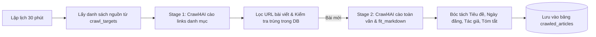

# 🚀 Hệ Thống Cào Tin Tức Tự Động (n8n + Crawl4AI + PostgreSQL)

Hệ thống cào tin tức 2 giai đoạn (2-Stage Crawler) siêu nhẹ, tiết kiệm tài nguyên và tối ưu chống chặn bot bằng sự kết hợp giữa **n8n Workflow**, **Crawl4AI Engine (Playwright)** và **PostgreSQL**.

---

## 📁 Cấu Trúc Thư Mục `crawl4ai/`

```text
crawl4ai/
├── docker-compose.yaml              # Cấu hình n8n, Crawl4AI REST API và PostgreSQL
├── .env                             # Biến môi trường (Port, Password, API Token)
├── init-db.sql                      # Khởi tạo bảng crawl_targets & crawled_articles
├── workflow_crawl4ai_news_pipeline.json # Toàn bộ n8n workflow tự động hoàn chỉnh
└── README.md                        # Hướng dẫn chi tiết sử dụng
```

---

## ⚡ Các Cổng Dịch Vụ (Ports)

Để tránh xung đột với các service cũ, stack này được cấu hình các port mặc định độc lập:

* **n8n UI**: [http://localhost:5679](http://localhost:5679)
* **Crawl4AI API**: [http://localhost:11235](http://localhost:11235) (Token: `crawl4ai_secret_token_2026`)
* **PostgreSQL DB**: `localhost:5434` (User: `postgres`, Password: `crawl4ai_password_2026`, DB: `news_db`)

---

## 🛠️ Hướng Dẫn Khởi Chạy

### 1. Khởi động các container Docker
Mở Terminal tại thư mục `crawl4ai` và chạy:

```bash
cd crawl4ai
docker compose up -d
```

Kiểm tra trạng thái các container:
```bash
docker compose ps
```
> Khi thấy cả 3 container `n8n`, `crawl4ai`, `postgres` đều `Up` (hoặc `healthy`), hệ thống đã sẵn sàng.

---

### 2. Thiết lập n8n và Import Workflow

1. Truy cập vào giao diện n8n: [http://localhost:5679](http://localhost:5679).
2. Tạo tài khoản quản trị ban đầu theo hướng dẫn của n8n.
3. **Thêm kết nối Database (Postgres Credential):**
   * Vào menu **Credentials** -> **New Credential** -> chọn **Postgres**.
   * Điền thông tin kết nối nội bộ giữa các container:
     * **Host**: `postgres`
     * **Database**: `news_db`
     * **User**: `postgres`
     * **Password**: `crawl4ai_password_2026`
     * **Port**: `5432`
     * **SSL**: `disable`
   * Đặt tên Credential: `Crawl4AI PostgreSQL DB` -> Bấm **Save**.
4. **Import Workflow:**
   * Vào **Workflows** -> Bấm biểu tượng 3 chấm góc phải trên -> chọn **Import from File**.
   * Chọn file: `crawl4ai/workflow_crawl4ai_news_pipeline.json`.
   * Gắn Credential Postgres vừa tạo vào các node Postgres (Node 1, Node 6, Node 10).
   * Bấm **Save** và bấm **Test step / Test workflow** để chạy thử.

---

## 🔄 Luồng Hoạt Động (2-Stage Pipeline)



1. **Giai đoạn 1 (Lấy Links):** Crawl4AI truy cập trang chuyên mục (CafeF, VnEconomy...), bóc tách các liên kết nội bộ `links.internal`. Workflow tự động lọc bỏ các link rác (menu, thẻ tag, video, quảng cáo...).
2. **Kiểm tra trùng lặp (Deduplication):** n8n kiểm tra nhanh trong bảng `crawled_articles`. Link nào đã có trong DB sẽ được bỏ qua, không tốn tài nguyên cào lại.
3. **Giai đoạn 2 (Cào Chi Tiết):** Crawl4AI truy cập từng link bài viết mới với chế độ lọc thông minh `fit_markdown`.
4. **Chuẩn hóa & Lưu trữ:** Bóc tách Tiêu đề, Ngày xuất bản, Tác giả, Tóm tắt, Nội dung sạch không rác, gắn nhãn cảm xúc và lưu vào database.

---

## 📊 Kiểm Tra Dữ Liệu Trong Database

Để kiểm tra các bài báo đã cào về thành công, bạn có thể chạy lệnh SQL sau ngay trong terminal:

```bash
docker compose exec postgres psql -U postgres -d news_db -c "
SELECT id, title, published_date, author, source_name 
FROM public.crawled_articles 
ORDER BY crawled_at DESC 
LIMIT 10;
"
```
